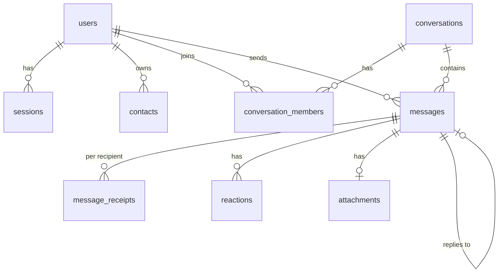

# Signal Clone

A functional clone of the Signal messenger: registration, contacts, one-to-one and group chats with
real-time delivery, receipts, typing indicators and presence, in a UI that follows Signal's design.
Built for the Scaler SDE Fullstack assessment. Encryption is **simulated** (as the brief allows).

- **Frontend:** Next.js 15 (App Router, TypeScript), Tailwind CSS v4, TanStack Query, Zustand
- **Backend:** Python 3.12, FastAPI, SQLAlchemy 2, Pydantic v2, SQLite
- **Real-time:** WebSockets (FastAPI native)

> Status snapshot: see [Feature status](#feature-status). Contributors / AI agents: read
> [`CLAUDE.md`](CLAUDE.md) first.

---

## Quick start

Requirements: Node 20+ (tested on 22), Python 3.12, npm.

### 1. Backend (port 8000)

```bash
cd backend
python -m venv .venv
.venv\Scripts\activate            # macOS/Linux: source .venv/bin/activate
pip install -r requirements-dev.txt
python -m uvicorn app.main:app --reload --port 8000
```

On first start the SQLite database (`backend/data/signal.db`) is created and seeded with demo data.
To reset the demo data, stop the server and delete `backend/data/`.
Interactive API docs: <http://localhost:8000/docs>.

### 2. Frontend (port 3000)

```bash
cd frontend
npm install
npm run dev            # development
# or, for a realistic speed check:
npm run build && npm run start
```

Open <http://localhost:3000>. The frontend finds the API at `http://<same host>:8000` automatically,
or at `NEXT_PUBLIC_API_URL` if set (see `frontend/.env.example`).

### 3. Demo accounts

Every account uses the fixed verification code **`123456`** (verification is mocked).

| Phone           | Name                | Notes                                    |
| --------------- | ------------------- | ---------------------------------------- |
| `+15550000001`  | Riley Chen          | main demo user, has all seeded chats     |
| `+15550000002`  | Maya Johnson        | log in as her in a second window to chat |
| `+15550000003`… | Paige, Mom, Julian, Kai, Michael (…03–…07) | other seeded contacts |

Any other valid number (with country code) registers a new account and goes through the profile step.

### Testing on a phone (same Wi-Fi)

```bash
# backend: listen on all interfaces
python -m uvicorn app.main:app --reload --port 8000 --host 0.0.0.0
# frontend
npm run dev -- -H 0.0.0.0
```

Open `http://<laptop-ip>:3000` on the phone. Windows Firewall must allow inbound TCP 3000 and 8000.
The backend's CORS already allows `192.168.x.x` / `10.x.x.x` origins on port 3000.

### Checks

```bash
cd backend  && python -m pytest && ruff check . && ruff format --check .
cd frontend && npm run typecheck && npm run lint && npx prettier --check "src/**/*.{ts,tsx,css}"
```

---

## Feature status

| Area | Status |
| --- | --- |
| Mock auth: phone (country code + number), fixed OTP, name + avatar, login/logout, persisted session | Done |
| Conversation list: recency sort, search, unread badges, last-message preview, online / last seen, pinned + muted indicators | Done |
| Add contact (phone / `@username`), user search, Note to Self | Done |
| 1:1 messaging: real-time, timestamps, sending → sent → delivered → read, typing indicator, persistence | Done |
| Groups: create, members, admin add / remove / promote, leave, rename, persistence | Done |
| Signal look & feel: list + chat layout, bubbles, modals, toasts, settings placeholders (privacy / notifications / appearance) | Done (polish ongoing) |
| Dark mode (system / light / dark, persisted) | Done |
| Responsive (desktop 3-pane, iPhone stacked routes + tab bar) | Done (tested on Windows desktop + iPhone only) |
| Disappearing messages | Backend done (timer, expiry filter); UI: timer picker in **Group info** only |
| Attachments (images / files / voice) | Backend done (upload, serve, kinds); **chat UI not built yet** |
| Reactions | Backend done (one per user, live updates); **picker UI not built yet** |
| Reply / quoted messages | Backend done; **UI not built yet** |
| Keyboard shortcuts | Not started |
| Voice / video calls, stories, linked devices | Placeholders ("coming soon") as the brief allows |
| Deployment (Vercel + always-on backend) | Not done |

---

## Architecture

```
┌──────────────────────────── browser ────────────────────────────┐
│ Next.js pages (thin)  →  features/*  (UI by domain)             │
│        ▲                       │ use                             │
│        │                  hooks/*  (data + behaviour)            │
│        │                       │                                 │
│  Zustand stores      TanStack Query cache  ◄── lib/realtime ◄─┐  │
│  (session, ui,             ▲ patch via lib/query/cache.ts     │  │
│   presence)                └──── lib/api/* (fetch) ──┐        │  │
└─────────────────────────────────────────────────────┼────────┼──┘
                                       REST /api/*    │        │ WebSocket /ws
┌─────────────────────────────────────────────────────▼────────┴──┐
│ FastAPI   api/routes (HTTP only) → services (rules) → models     │
│           realtime/notifier → realtime/manager (sockets)         │
│ SQLite (SQLAlchemy 2)                          media/ (uploads)  │
└──────────────────────────────────────────────────────────────────┘
```

### Backend (`backend/app`)

| Folder | Responsibility |
| --- | --- |
| `api/routes/` | HTTP only: parse request, call a service, return a DTO. `ws.py` is the WebSocket endpoint. |
| `services/` | All business rules and permissions (auth, conversations, messages, receipts, presence…). `presenters.py` builds viewer-specific DTOs. |
| `models/` | SQLAlchemy ORM (the schema below). |
| `schemas/` | Pydantic request / response models. camelCase on the wire, snake_case in Python. |
| `realtime/` | `manager.py` (open sockets per user), `notifier.py` (domain change → per-user events), `events.py` (event names). |
| `core/`, `db/` | Settings, errors, clock, token hashing; engine / session / UTC datetime type. |
| `seed/` | Demo data that mirrors Signal's marketing screens (+ sample media). |

Design choices worth knowing:

- **Send over REST, receive over WebSocket.** Messages are validated, persisted and idempotent
  (`UNIQUE(sender_id, client_id)`); the WebSocket only pushes events plus typing / ping from the client.
- **Services are synchronous** (run in FastAPI's threadpool); `ConnectionManager.dispatch` is thread-safe
  and hands sends to the event loop.
- **Receipts:** one row per (message, recipient). The sender's tick state is aggregated: *delivered* when
  every recipient has it, *read* when every recipient has read it. A message is marked delivered
  immediately if the recipient has an open socket, and on reconnect otherwise.
- **Direct chats are invisible until the first message** (for both people); the recipient learns about the
  chat with the first message. Groups and Note to Self are listed immediately.
- **Ordering:** conversations are sorted by `last_message_at` on the server and by the same
  `lastActivityAt` on the client, so a reload and a live update give the same order.
- **Single instance:** the connection manager is in memory, so run one backend process.

### Frontend (`frontend/src`)

| Folder | Responsibility |
| --- | --- |
| `app/` | Routes only: `(auth)` register / verify / profile, `(app)` chats / calls / stories / settings. |
| `features/` | UI by domain: `auth`, `chat`, `conversations`, `groups`, `settings`, `shell`. |
| `components/ui`, `components/icons` | Reusable primitives (Avatar, Badge, Modal, PhoneField, Toggle…) and the `Icon` (CSS-mask SVG) component. |
| `hooks/` | Data + behaviour (`useConversations`, `useMessages`, `useSendMessage`, `useMarkRead`, `useTyping`…). Components never call the API directly. |
| `lib/api/` | One module per resource + `http.ts` (fetch wrapper, bearer token, timeout, `ApiError`). |
| `lib/query/` | Query keys and `cache.ts`: pure helpers that patch the cache, shared by HTTP mutations and WebSocket events. |
| `lib/realtime/` | `socket.ts` (reconnecting WebSocket), `handleEvent.ts` (the only place events are interpreted). |
| `stores/` | Zustand: `session` (persisted), `ui` (modals, toasts, active chat), `presence` (typing / online). |

Styling: Tailwind with **CSS-variable design tokens** in `app/globals.css` (colours sampled from Signal's
official screens; light + dark). All sizes are `rem`; on desktop the root font scales from 13px to 16px
with the window, on iPhone it stays 16px.

---

## Database schema (SQLite)



| Table | Key columns / notes |
| --- | --- |
| `users` | `phone` UNIQUE (E.164), `username` UNIQUE NULL, `display_name` (empty until onboarding step), `about`, `avatar_path`, `last_seen_at` |
| `sessions` | `token_hash` UNIQUE (SHA-256 of the bearer token), `expires_at`, `revoked_at` (real logout) |
| `contacts` | PK (`owner_id`, `contact_id`), directional address book |
| `conversations` | `type` (`direct`/`group`/`note_to_self`), `title`, `direct_key` UNIQUE ("minId:maxId": no duplicate DMs), `disappearing_seconds`, `last_message_at` (indexed, list sort key) |
| `conversation_members` | PK (`conversation_id`, `user_id`); `role` (admin/member), `joined_at`, `left_at` (soft leave), `last_read_message_id` (unread = newer messages from others), per-user `is_pinned`, `is_muted`, `chat_theme` |
| `messages` | `kind` (text/image/file/voice/system), `body`, `reply_to_id` (self FK), `client_id` (idempotency, UNIQUE with `sender_id`), `expires_at` (disappearing), `deleted_at`; index (`conversation_id`, `id`) for paging |
| `message_receipts` | PK (`message_id`, `user_id`), `delivered_at`, `read_at` |
| `reactions` | PK (`message_id`, `user_id`) → one reaction per user per message |
| `attachments` | `message_id` UNIQUE NULL (uploaded first, attached on send), `mime_type`, `size_bytes`, `storage_path`, `width`/`height`, `duration_sec` |

Notes: foreign keys are enforced (`PRAGMA foreign_keys=ON`); timestamps are UTC (custom `UTCDateTime`
type keeps them timezone-aware); new group members only see history from when they joined.

---

## API overview

REST under `/api` (bearer token in `Authorization`), full schema at `/docs`.

| Area | Endpoints |
| --- | --- |
| Auth | `POST /auth/request-otp` · `POST /auth/verify-otp` → `{token, user, isNewUser}` · `POST /auth/logout` |
| Profile | `GET/PATCH /me` · `POST /me/avatar` |
| People | `GET /users/search?q=` · `GET/POST /contacts` · `DELETE /contacts/{id}` |
| Conversations | `GET /conversations` · `POST /conversations/direct` · `POST /conversations/group` · `GET/PATCH /conversations/{id}` · `PATCH /conversations/{id}/me` (pin / mute / theme) |
| Members | `POST /conversations/{id}/members` · `DELETE/PATCH /conversations/{id}/members/{userId}` (admin only; anyone may remove themselves) |
| Messages | `GET /conversations/{id}/messages?before=&limit=` · `POST /conversations/{id}/messages` · `POST /conversations/{id}/read` |
| Reactions | `PUT/DELETE /messages/{id}/reaction` |
| Attachments | `POST /attachments` (multipart); files are served from `/media/…` |

**WebSocket** `/ws?token=…`

- Server → client: `message.created`, `message.status`, `reaction.updated`, `conversation.updated`,
  `conversation.removed`, `typing`, `presence` (envelope: `{ "type": "...", "data": { … } }`).
- Client → server: `{"type":"typing","conversationId":1,"isTyping":true}`, `{"type":"ping"}`.

---

## Assumptions and simplifications

- **Auth is mocked:** any valid E.164 number + the fixed code `123456`. A number without a country code is
  rejected (never guessed). No real SMS, no key exchange; "end-to-end encryption" is simulated.
- **Single backend instance** with SQLite and local file storage. For deployment it needs a persistent
  volume (database + `media/`) and must not scale horizontally.
- **Ids are integers** in the API. Timestamps are ISO-8601 UTC.
- **Muting** suppresses notifications and greys the unread badge; muted chats are excluded from the tab badge.
- **Expired (disappearing) messages** are hidden by queries; there is no background purge yet.
- Verified on Windows desktop browsers and iPhone Safari only (per the brief's scope of testing).
- Windows browsers do not render flag emoji, so the country picker shows ISO codes.

## Credits

- Icons are from the open-source [Signal-Desktop](https://github.com/signalapp/Signal-Desktop) icon set
  (AGPL-3.0); the pin icon is hand-drawn. Used here for an assessment clone.
- Seed avatars / photos are stock images (randomuser.me portraits, picsum.photos).
